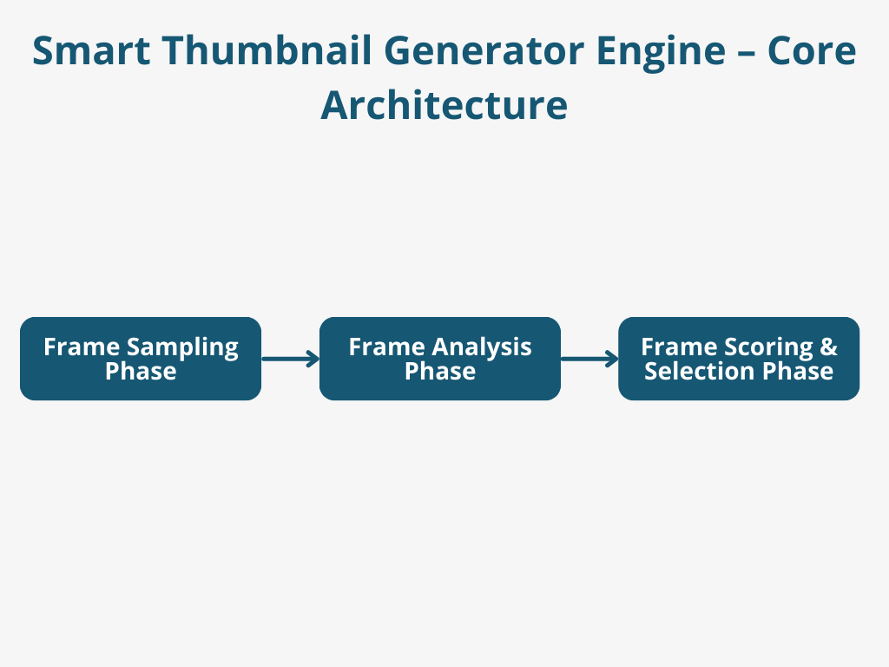
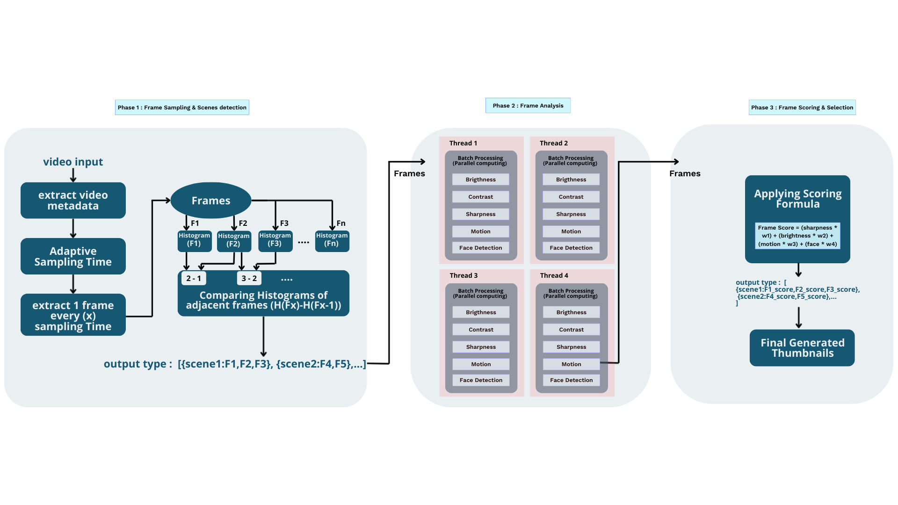

# Smart Thumbnail Generator Engine 🏞️ 🚀

A high-performance Flutter-based engine designed to intelligently extract, analyze, and select the most visually compelling thumbnails from video content. By leveraging **Adaptive Sampling**, **Parallel Multi-threading**, and a **Weighted Scoring Algorithm**, this engine automates the selection of high-quality "hero images" for any video input.

---

## 📺 Demo
Check out the engine in action:  
[▶ Watch the Demo](https://www.youtube.com/shorts/5x0i9wXNs9o)

---

## 🏗 System Architecture

The engine operates in three distinct phases to ensure efficiency, accuracy, and UI responsiveness.



### Phase 1: Frame Sampling & Scene Detection
To minimize computational load, the engine avoids processing every single frame of the video bitstream.
* **Metadata Extraction:** Analyzes video properties (duration, bitrate, resolution).
* **Adaptive Sampling Time:** Determines the optimal sampling interval ($x$) based on the total video length.
* **Scene Boundary Detection:** Uses **Histogram Comparison** to identify scene transitions.
    * It calculates the difference between adjacent frames: $H(F_x) - H(F_{x-1})$.
* **Output Data Structure:** A mapped collection of scenes containing specific frame sets.
    > `output type : [{scene1: F1, F2, F3}, {scene2: F4, F5}, ...]`

---

### Phase 2: Frame Analysis (Parallel Computing)
This phase utilizes a **Multi-threaded Isolate Pool** to perform heavy image processing without blocking the Flutter main thread (UI).



* **Batch Processing:** Frames are distributed across multiple threads (Thread 1 through Thread $n$).
* **Feature Extraction:** Each frame undergoes five critical visual evaluations:
  1. **Brightness:** Identifies under/overexposed frames.
  2. **Contrast:** Measures the dynamic range of the image.
  3. **Sharpness:** Detects blurriness or focus issues.
  4. **Motion:** Evaluates pixel displacement to avoid "action-blur" distortions.
  5. **Face Detection:** Prioritizes frames containing human subjects for higher engagement.

---

### Phase 3: Frame Scoring & Selection
In the final phase, the engine applies a mathematical model to rank the analyzed frames within their respective scenes.

#### ⚖️ The Scoring Formula
Each frame is assigned a **Frame Score** based on a weighted sum of its analyzed features:

```txt
FrameScore = (sharpness * w1) +
             (brightness * w2) +
             (motion * w3) +
             (face * w4)
```

* **Selection Logic:** The engine compares scores within each scene group.
* **Output:** The highest-scoring frame per scene is exported as the **Final Generated Thumbnail**.

---

## 🛠 Technical Stack
* **Language:** Dart / Flutter
* **Concurrency:** Dart Isolates (Worker Threads) for Phase 2.
* **Image Processing:** Histogram-based analysis and feature extraction.

| Stage | Process | Output |
| :--- | :--- | :--- |
| **Input** | Video File | Raw Bitstream |
| **Phase 1** | Adaptive Sampling | Grouped Scenes |
| **Phase 2** | Parallel Analysis | Feature Vectors |
| **Phase 3** | Scoring Formula | **Optimized Thumbnails** |

---